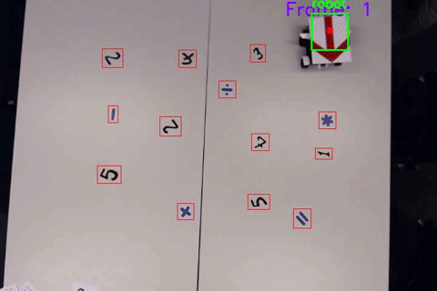

# Computer Vision Project
## EE-451 Image Analysis and Pattern Recognition

OpenCV Python program analyzing a video that presents a mobile robot composing a math problem.

## Table of contents
* [1. Description](#1-description)
* [2. Getting started](#2-getting-started)
    * [2.1 Dependencies](#21-dependencies)
    * [2.2 Installing](#22-installing)
    * [2.3 Executing program](#23-executing-program)
* [3. Version history](#3-version-history)

<!-- toc -->

## 1. Description
Computer vision special project as part of the EPFL EE-451 Image Analysis and Pattern Recognition course
aiming at solving a math problem described by the trajectory of a robot based solely on a recorded video.
A combination of traditional image analysis methods (binarization using Otsu thresholding, image growing, HSV ranges, morphology, etc.)
and artificial neural networks (CNN and MLP) are used to solve the task.

The problem is the divided into 4 steps:

1. Robot localization
2. Shapes detection
3. Digits recognition
4. Operators recognition

(Cf. [YouTube video](https://www.youtube.com/watch?v=J66b9tz4X88&t=25s) for more details)

## 2. Getting started

### 2.1 Dependencies
* Tested on macOS Catalina version 10.15.7
* Python 3.7

### 2.2 Installing
`pip install -r requirements.txt`

### 2.3 Executing program
`python3.7 main.py`

## 3. Version history
* 0.1
    * Initial release